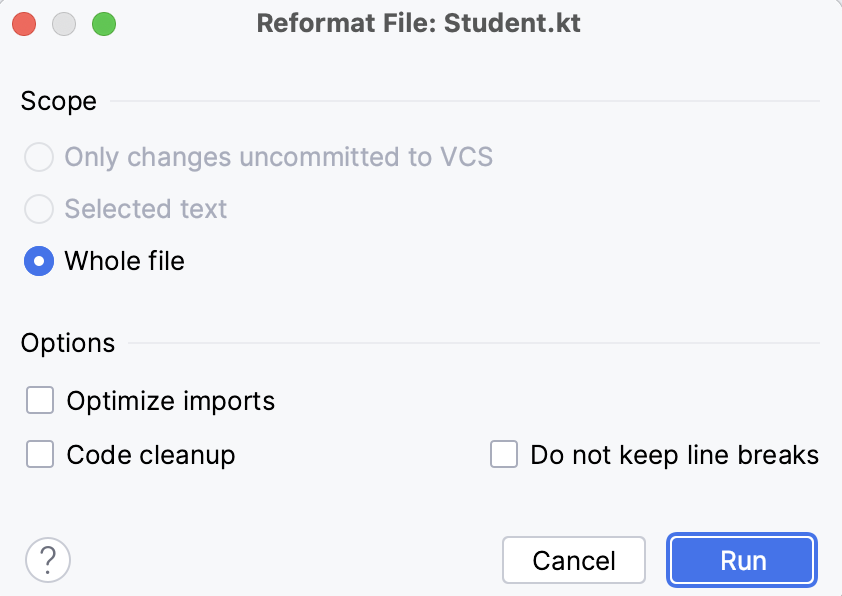

# Task 2/4: Reformat the code using IDE

In this task, you will learn very useful shortcut that will format the code automatically according to the project’s settings.

To perform any refactoring in IDE, you can use Refactoring Menu or specific hotkey. 
It’s also possible to configure custom hotkeys.
Use &shortcut:ReformatCode; (or Ctrl + Alt + L for Windows and Linux) shortcut to make IDE automatically reformat your code.
You can run it on some specific code fragment if you first select it and then type shortcut or you can run it on whole file.

You can specify reformatting settings in Reformat dialog, which is available by pressing &shortcut:ShowReformatFileDialog;.
In this dialog, you can specify the scope of formatting changes and selects options to apply:
- **Optimize imports** option will remove all unused imports in your file. Alternatively, you can invoke it using the &shortcut:OptimizeImports; (Ctrl+Alt+O for Windows, Linux) hotkey.
- **Code cleanup** option runs code cleanup inspections.
- **Do not keep line breaks** option reformats line breaks according to the code style settings.

