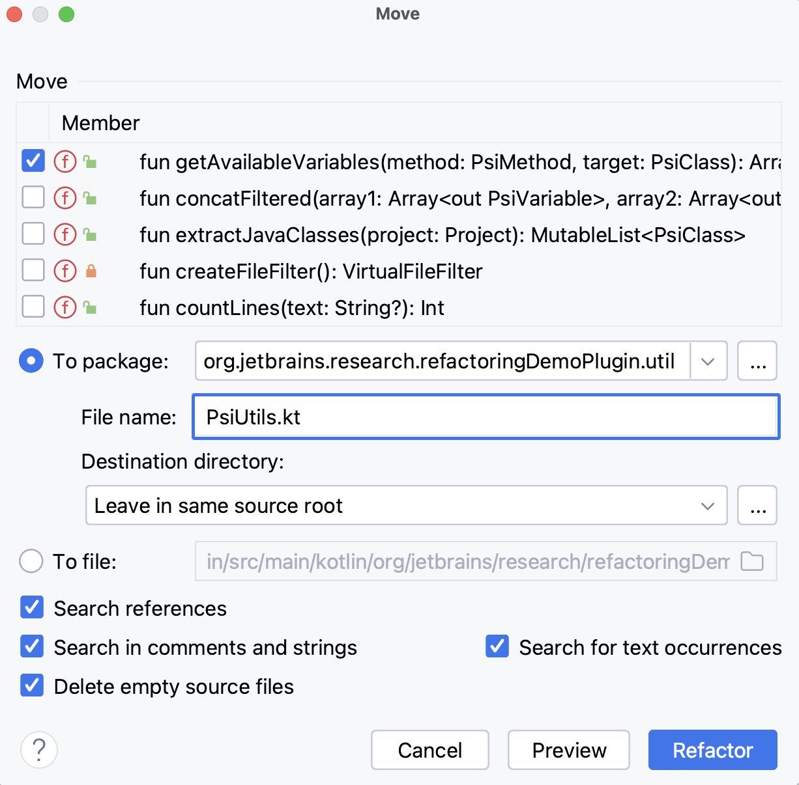

# Task: 1/4: What is Move Method refactoring?

The next refactoring that we learn in this course is **_Move refactoring_**, which is a process of moving a code
entity (e.g., a method or a class) from one place to a more appropriate place, making the codebase more organized and
easier to understand. We apply Move refactoring when we want to improve the structure of the code, enhancing its
readability, maintainability, and extensibility.

Sometimes a function or property is used more in another class than in its own class. Other times a class is
collaborating more with other classes from another package. These are all examples of **_Feature Envy_** code smell. To
resolve this, we move the code entity closer to the other entities that it interacts with.

To perform move refactoring, click on a code element you want to move and press **F6** shortcut. When the refactoring
dialog appears, specify the target class/package and click Refactor. It is also possible to see a refactoring preview.

    

