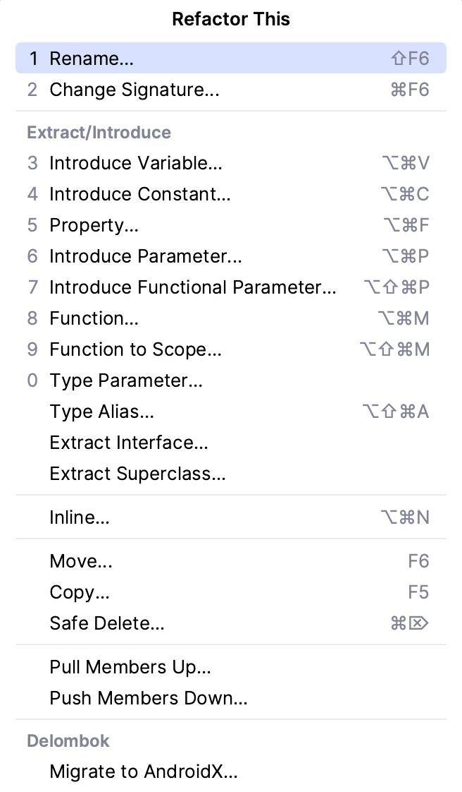

# Task 4/4: Getting familiar with IDE refactoring features

To invoke refactoring in IntelliJ IDEA, select an item to refactor (variable, method, class, package, etc)
and press &shortcut:Refactorings.QuickListPopupAction; (Mac) or Shift+Ctrl+Alt+T (Windows/Linux) to open a list of refactorings that can be applied.
You can also use a hotkey to invoke specific refactoring. 
It is possible to undo any refactoring by pressing &shortcut:$Undo;.

Moreover, for some refactorings, IntelliJ IDEA allows users to see the preview before applying changes.
It could be useful if you are not sure how refactoring changes would affect your code and want to make sure that it
would work as you expect.

Here is a table with the most popular refactorings and hotkeys to invoke them:

| Refactoring type       | Description                                                           | Shortcut                            |
|------------------------|-----------------------------------------------------------------------|-------------------------------------|
| **Rename**             | Changes the name of the code element.                                 | &shortcut:RenameElement;            |
| **Change Signature**   | Allows to change the method’s name, parameters, and return type.      | &shortcut:ChangeSignature;          |
| **Introduce Variable** | Extracts value into a new variable.                                   | &shortcut:IntroduceVariable;        |
| **Inline**             | Removes variable/method and moves its body to the place it’s used at. | &shortcut:Inline;                   |
| **Extract Method**     | Creates a new method and moves a selected piece of code to it.        | &shortcut:ExtractMethod;            |
| **Move**               | Moves code method/class to another place in the codebase.             | &shortcut:DatabaseView.MoveToGroup; |

We will discuss these and other refactorings in the next lessons.
