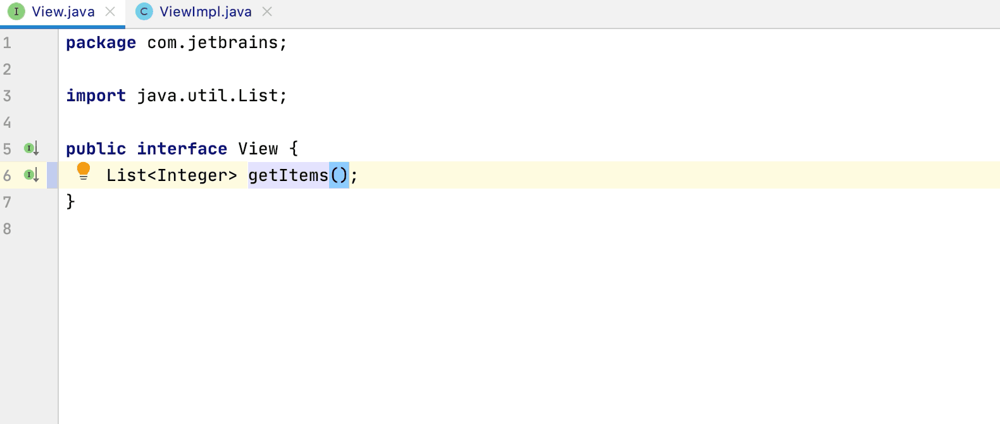

If you want to rename a code entity, you can click on the entity’s name and select **Refactor > Rename** or run &shortcut:RenameElement; shortcut. 
IDE will provide several options for renaming, you can choose one of them or type your version. 
After you pick a new name, IDE will automatically change all occurrences of the entity according to a new name.

See Also: https://kotlinlang.org/docs/coding-conventions.html#names-for-test-methods
